# System Diagram

Component diagram of the SCCA platform as implemented in `src/`. This version was
verified against the codebase (every node and edge below was confirmed by reading
the source); see the corrections list at the bottom for what changed relative to
the previous revision.

```mermaid
flowchart TD
    User([User])
    Groq["Groq AI"]
    Polar["Polar Payments"]

    subgraph UX["User Experience"]
        Dashboard["Chat Dashboard<br/>[dashboard/page.tsx]"]
        ChatUI["Chat Components<br/>[SCCAChatArea.tsx]"]
        Hook["API Client Hook<br/>[hooks/useScca.ts]"]
    end

    subgraph Chat["Chat and Encryption"]
        ConvAPI["Conversation API<br/>[conversations/route.ts<br/>+ conversations/[id]/route.ts]"]
        MsgAPI["Message API<br/>[conversations/[id]/messages/route.ts]"]
        EditAPI["Destructive Editing<br/>[conversations/[id]/edit/route.ts]"]
        AIClient["AI Client<br/>[lib/ai/client.ts]"]
        DB["Conversation Data Access<br/>[lib/db/client.ts]"]
        Crypto["Crypto Engine<br/>[lib/crypto/engine.ts]"]
        PG[("PostgreSQL<br/>[prisma]")]
    end

    subgraph Access["Access and Metering"]
        Keys["API Key Management<br/>[keys/route.ts + keys/[id]/route.ts]"]
        KeyAuth["API Key Auth<br/>[lib/api-key-auth.ts]"]
        Usage["Usage Analytics API<br/>[usage/route.ts]"]
        Auth["Authentication<br/>[auth/[...nextauth]/route.ts<br/>+ auth/register/route.ts]"]
        Tier["Tier Limits<br/>[lib/rate-limit.ts]"]
        Session["Session Checks<br/>[lib/session.ts]"]
    end

    subgraph Ext["Extensions and Billing"]
        Webhook["Polar Webhook<br/>[webhooks/polar/route.ts]"]
        Billing["Billing API<br/>[billing/route.ts<br/>+ checkout + invoices]"]
        Vault["Vault API<br/>[vault/encrypt + decrypt + verify]"]
        Media["Media API<br/>[media/route.ts + media/[id]/route.ts]"]
        Processor["Media Processor<br/>[lib/media/processor.ts]"]
    end

    %% User Experience
    User -->|uses| Dashboard
    Dashboard -->|renders| ChatUI
    ChatUI -->|actions bubble up via callbacks| Dashboard
    Dashboard -->|invokes| Hook
    Hook -->|loads conversations| ConvAPI
    Hook -->|sends messages| MsgAPI
    Hook -->|edit / delete / regenerate| EditAPI
    Hook -->|uploads attachments| Media
    MsgAPI -.->|"streams response (SSE)"| Hook
    EditAPI -.->|"streams response (SSE)"| Hook

    %% Chat and Encryption
    MsgAPI -->|requests completion| AIClient
    EditAPI -->|regenerates response| AIClient
    AIClient -.->|calls Groq| Groq
    ConvAPI -->|creates and lists| DB
    MsgAPI -->|reads and writes| DB
    EditAPI -->|persists edits| DB
    MsgAPI -->|decrypts messages| Crypto
    EditAPI -->|edits encrypted messages| Crypto
    DB -->|packs message tokens| Crypto
    DB -->|reads and writes| PG

    %% Access and Metering
    Session -->|resolves session via authOptions| Auth
    ConvAPI -->|authenticates| Session
    MsgAPI -->|authenticates| Session
    EditAPI -->|authenticates| Session
    ConvAPI -->|"checks tier (POST)"| Tier
    MsgAPI -->|checks tier| Tier
    EditAPI -->|checks tier| Tier
    MsgAPI -->|records usage| Tier
    EditAPI -->|records usage| Tier
    ConvAPI -->|"records usage (POST)"| Tier
    Keys -->|checks key tier| Tier
    Keys -->|stores key hashes| PG
    KeyAuth -->|verifies key hashes| PG
    Usage -->|checks limits| Tier
    Usage -->|aggregates usage| PG
    Tier -->|reads usage counters and budgets| PG

    %% Extensions and Billing
    Billing -->|initiates checkout| Polar
    Billing -->|generates invoice PDFs| Polar
    Polar -.->|sends signed events| Webhook
    Webhook -->|updates billing and invoices| PG
    Billing -->|reads and updates billing| PG
    Billing -->|authenticates| Session
    Media -->|authenticates| Session
    Media -->|stores attachments| PG
    Media -->|derives keys| Crypto
    Media -->|encrypts / decrypts media| Processor
    Vault -->|"authenticates (API key, session fallback)"| KeyAuth
    Vault -->|encrypts and verifies| Crypto
    Vault -->|checks limits and records usage| Tier

    classDef ui fill:#cde4ff,stroke:#5b8def,color:#1a1a1a
    classDef chat fill:#fff3c4,stroke:#d4a017,color:#1a1a1a
    classDef access fill:#d2f8d2,stroke:#3aa655,color:#1a1a1a
    classDef ext fill:#ffd9d9,stroke:#d4577a,color:#1a1a1a
    classDef external fill:#dbe9ff,stroke:#7aa5e8,color:#1a1a1a

    class Dashboard,ChatUI,Hook ui
    class ConvAPI,MsgAPI,EditAPI,AIClient,DB,Crypto,PG chat
    class Keys,KeyAuth,Usage,Auth,Tier,Session access
    class Webhook,Billing,Vault,Media,Processor ext
    class User,Groq,Polar external
```

## Corrections relative to the previous revision

These were verified against the source before drawing:

1. **Crypto Engine no longer writes to PostgreSQL.** `lib/crypto/engine.ts` is pure
   crypto (imports only `crypto`/`zlib`). Encrypted tokens reach the database via
   `lib/db/client.ts`, which imports `packMessage`/`computeNextMerkleRoot` — so the
   edge is now Data Access → Crypto Engine ("packs message tokens") plus the
   existing Data Access → PostgreSQL edge.
2. **"Regenerates response" starts at Destructive Editing, not Message API.**
   Regeneration is implemented in `conversations/[id]/edit/route.ts`
   (`streamAIResponse` after `destructiveEdit`).
3. **Chat Components are presentational.** `SCCAChatArea.tsx` makes no HTTP calls;
   all API traffic goes through the `useScca` hook driven by
   `dashboard/page.tsx`, which is now a node. SSE streaming responses are drawn as
   dotted return edges.
4. **Authentication ↔ Session Checks direction fixed.** `lib/session.ts` imports
   `authOptions` from `lib/auth` and calls `getServerSession`; the edge runs from
   Session Checks toward Authentication.

## Nodes and edges added

- **API Key Auth (`lib/api-key-auth.ts`)** — runtime Bearer-key authentication;
  the Vault API authenticates through it (API key first, session fallback).
- **Metering write path** — Message/Edit/Conversation (POST) routes call
  `recordUsage()` on Tier Limits, which reads sliding-window counters and budgets
  from PostgreSQL.
- **Conversation API node** now explicitly includes `conversations/[id]/route.ts`
  (GET with viewport pagination + Merkle verification, PATCH, DELETE).
- **Media API** now includes `media/[id]/route.ts` (decrypt/download, delete) and
  its key-derivation edge to the Crypto Engine.
- **Billing API → Polar** gained the invoice-PDF edge
  (`billing/invoices/[id]/route.ts` calls Polar's REST API directly).
- **Vault API → Tier Limits** (all three vault routes check limits and record usage).
- **Polar Webhook** edge labeled "sends signed events" — the webhook authenticates
  via Polar signature verification, not session checks.

## Known simplifications

- `src/lib/polar.ts` (SDK client, tier mapping, auto-upgrade logic) is folded into
  the Billing/Webhook paths rather than drawn as its own node.
- Cross-cutting audit logging (`createAuditLog`) is omitted for readability.
- `POST /api/ai/transcribe` (voice input) and `rate-limits/route.ts` (status
  endpoint) are not drawn.
