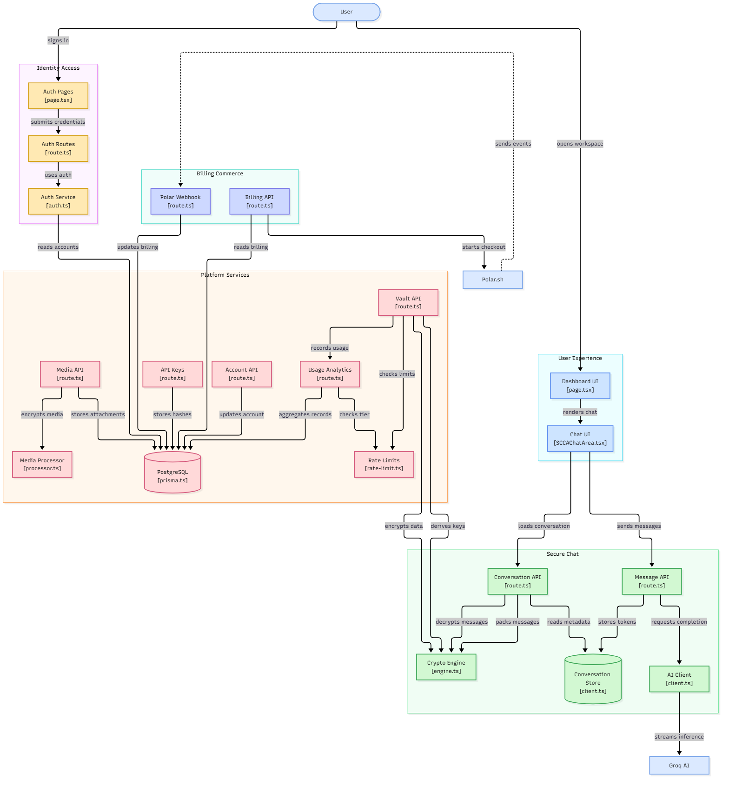
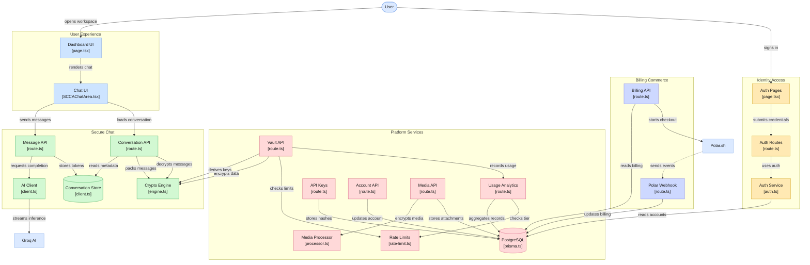

# System Diagram — Legacy (v1, superseded)

> **Archived for comparison.** This is the pre-overhaul architecture, kept so the
> changes in [06-system-diagram.md](06-system-diagram.md) (current, verified
> against the codebase) are easy to see. Do not use this as implementation
> reference — several edges here were found to be inaccurate when checked
> against the source.

## What changed in the overhaul (v1 → current)

- **Identity Access dissolved** — the standalone Auth Pages / Auth Routes / Auth
  Service grouping merged into **Access and Metering** (Authentication route +
  `lib/session.ts` Session Checks + `lib/api-key-auth.ts` API Key Auth).
- **Platform Services split** — metering concerns (keys, usage, rate limits) moved
  to **Access and Metering**; vault/media moved to **Extensions and Billing**.
- **Destructive Editing** (`conversations/[id]/edit/route.ts`) appeared as its own
  node in Chat and Encryption; regeneration moved there from the Message API.
- **Conversation Store renamed to Conversation Data Access** and became the only
  path by which encrypted tokens reach PostgreSQL (the v1 "Crypto Engine stores
  tokens" implication was removed).
- **API Client Hook (`useScca.ts`)** added — Chat UI turned out to be
  presentational; all API traffic goes through the hook.
- **Account API** was absorbed into session/account routes and no longer appears
  as a separate Platform Services node.
